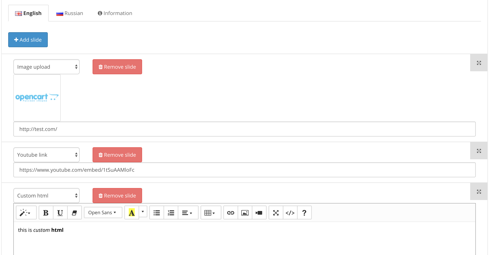

# FOC:Carousel

With this module, you can easily create unlimited carousel blocks for your Opencart store.

**Opencart 2.3 and 3 supported**

**Main features:**

0. Create unlimited carousels sub-modules and easily add them to your store via Opencart layouts
1. Choose from 3 different slide types: image/youtube/wysiwyg
2. Create different carousels content for different languages
3. Customize frontend templates for each carousel you want with template postfix feature
4. D&D support - easily reorder your slides with mouse

### How to use custom templates?

Just add postfix setting to carousel block and create `foc_carousel_<prefix>.tpl` file. After this, carousel block will use custom template.

